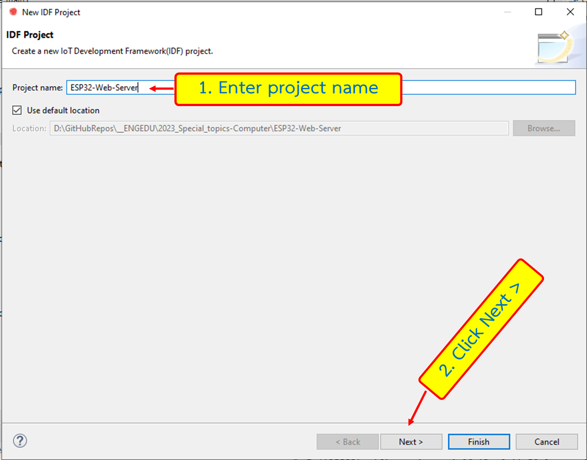
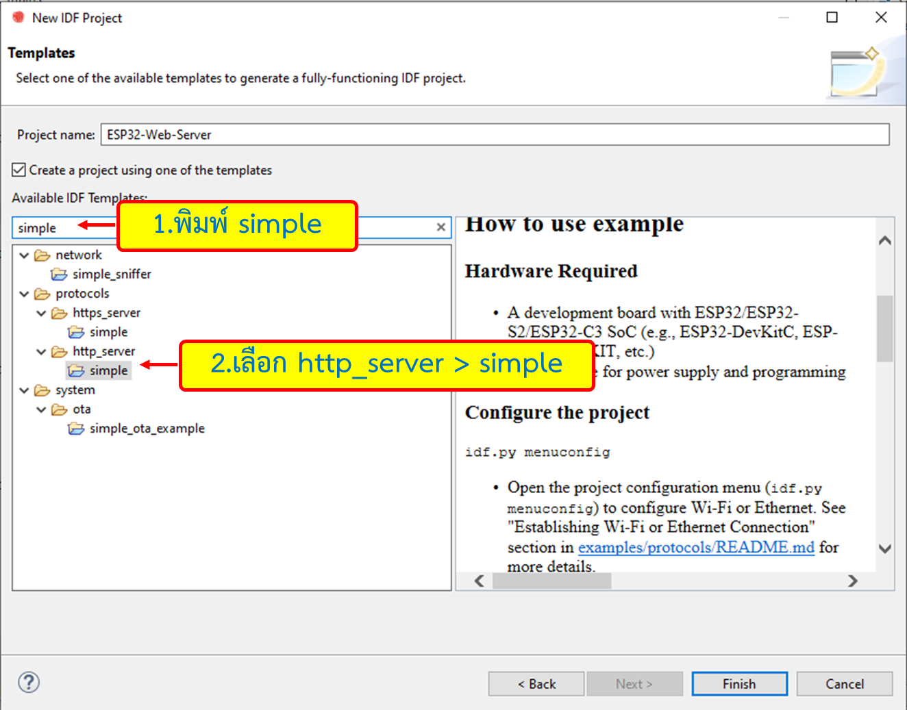
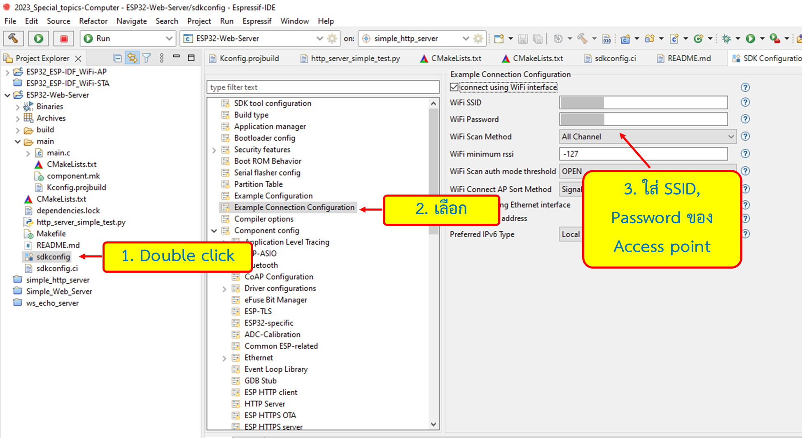
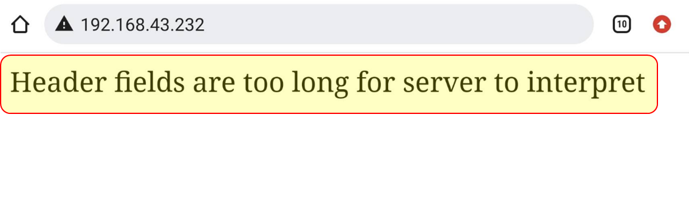
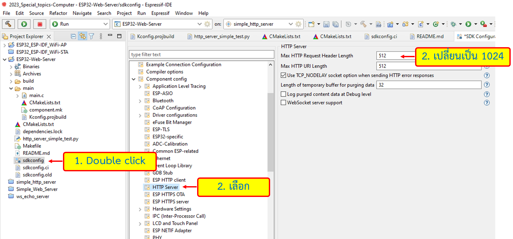
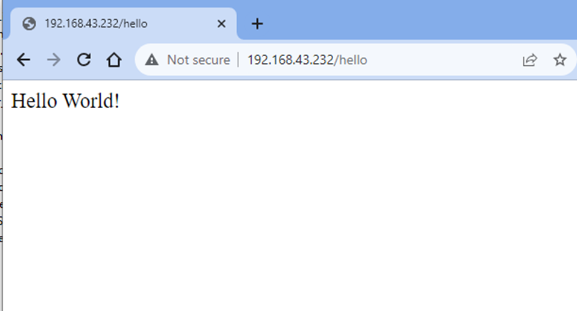

# การทดลอง Webserver อย่างง่ายด้วย ESP32

##  ขั้นตอนการทดลอง 
### 1. สร้าง Project ใหม่ ชื่อ ESP32-Web-Server

1.1 ใช้ template simple server

###  2. Build โปรเจค 1 ครั้ง 
เพื่อให้ระบบสร้างไฟล์ sdkconfig เราจะเข้าไปแก้ WiFI ssid และ password
 

###  3. รันโปรแกรม แก้ไขที่ผิด (ถ้ามี)

พบ error เนื่องจากค่าเริ่มต้นของโปรแกรมกำหนดให้ความยาวของ HTTP request header มีต่าสูงสุด 152 ตัวอักษร เราต้องแก้ให้เป็น 1024 

###  4. แก้ไข Max HTTP Request Header Lenght เป็น 1024

###  5. รันโปรแกรม แก้ไขที่ผิด (ถ้ามี)

ตัวอย่างผลการทำงาน (เมื่อดูจาก browser)

###  6. บันทึกผลการทดลอง ทั้งที่หน้าจอ monitor ของ ESP32 และหน้า Web browser

###  7. ส่งงาน
pull request พร้อมแนบ link ไปยัง repository ของโปรเจคด้วยนะ

